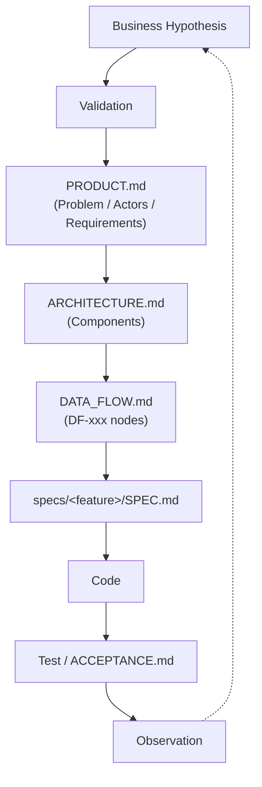

# Repository Development Contract

코드를 쓰기 전에 "무엇을, 왜, 어떻게 만드는가"를 문서로 먼저 고정하고, 그 문서를 코드와 함께 Git으로 버전관리하는 프로젝트 템플릿입니다. 사람과 AI 코딩 에이전트(Claude Code, Codex 등)가 같은 문서를 Source of Truth로 참조하도록 만드는 것이 목적입니다.

## 이 템플릿을 쓰는 이유

AI가 구현을 상당 부분 대신하는 환경에서는, 코드를 읽고 알아서 아키텍처를 추론시키면 시간이 지날수록 architecture drift가 생기기 쉽습니다. 반대로 아래 순서를 문서로 명시해두면, 그 문서가 AI 에이전트에게는 구현 제약이 되고 사람에게는 리뷰 기준이 됩니다.



## 사용 방법

1. 이 리포에서 **Use this template**으로 새 리포 생성 (또는 `gh repo create <name> --template <this-repo>`).
2. `docs/PRODUCT.md`를 채웁니다 — 가설/문제/Actor/성공지표/Business Requirement.
3. `docs/ARCHITECTURE.md`를 채웁니다 — Component 단위로 책임/입출력/실패 동작을 정의합니다.
4. `docs/DATA_FLOW.md`를 채웁니다 — 데이터가 어디서 와서 어떻게 변환되고 어디로 가는지 `DF-xxx` ID로 노드를 정의합니다.
5. 첫 기능을 구현하기 전에 `specs/_template/`을 `specs/<feature-name>/`으로 복사해 `SPEC.md`, `ACCEPTANCE.md`를 작성합니다.
6. AI 에이전트에게 구현을 맡길 때는 항상 `AGENTS.md`의 규칙을 전제로 작업을 지시합니다.

구현 코드는 프로젝트 언어 관례에 따라 `src/`(또는 해당 언어의 표준 위치)에, 테스트는 `tests/` 아래 대응 구조로 둡니다. 이 구조는 프로젝트마다 다르므로 이 템플릿이 강제하지 않습니다.

## 문서 구조

| 파일 | 역할 | 필수 여부 |
|---|---|---|
| `AGENTS.md` | AI 에이전트 행동 규칙, Source of Truth 우선순위, ID 규칙 | 필수 |
| `docs/PRODUCT.md` | 가설, 문제, Actor, 성공지표, Business Requirement | 필수 |
| `docs/ARCHITECTURE.md` | Component 책임/입출력/실패 동작 | 필수 |
| `docs/DATA_FLOW.md` | 데이터 lineage, `DF-xxx` 노드 | 필수 |
| `docs/decisions/ADR-template.md` | 구조적 결정 기록 (복사해서 `ADR-<번호>-<slug>.md`로 사용) | 필요할 때 |
| `specs/_template/` | Feature 단위 SPEC/ACCEPTANCE 템플릿 | 기능 개발 시 필수 |

## 확장하기

프로젝트가 복잡해지면 `docs/DOMAIN_MODEL.md`, `docs/WORKFLOWS.md`, `docs/STATE_MODEL.md` 등을 필요한 시점에 추가합니다. 새 문서를 추가할 때는 `ARCHITECTURE.md`와 동일한 헤더 패턴(Responsibility / Input / Output / Owner / Failure)을 재사용하세요. 문서 형식을 새로 만들지 않는 것이 핵심입니다. 자세한 규칙은 `AGENTS.md`를 참고하세요.

## 검증 우선 하네스 확장

문서 계약에 **증상 → 실제 진입점 → AC → 검증 명령 → 실행 증거 → 반례**를 연결하는 선택적 확장입니다. 제품 런타임이나 새로운 멀티에이전트 오케스트레이터는 아닙니다.

```sh
# Python 3.10+; 외부 패키지 설치 없음
python -m unittest discover -s tests -p 'test_*.py' -v
python tools/verify_contract.py lint --root . --map verification/feature-map.json
```

`lint` 성공은 지도 구조가 유효하다는 뜻이며 제품 검증 완료가 아닙니다. 실행 증거 검증은 `receipt` 서브커맨드로 별도 수행합니다. 스키마, 생산자 신뢰 한계, Windows/POSIX 적용 절차는 [HARNESS](docs/HARNESS.md)를 보세요.

| 파일 | 역할 |
|---|---|
| `verification/feature-map.json` | 이 저장소 검증기의 실제 진입점·AC·정상/반례 검사 지도 |
| `tools/verification_contract.py`, `tools/verify_contract.py` | 읽기 전용 계약/증거 gate |
| `tests/test_verification_contract.py` | 정상 및 결함 주입 회귀시험 |
| `verification/skills/verify-feature.md` | 모델/adapter 중립 검증 절차와 skill eval rubric |
| `docs/LOCAL_HARNESS_ADOPTION.md` | 기존 feature_list·registry·lease·verify.sh 보존형 이관 및 로컬 작업 지시 |
| `specs/verification-gate/` | 이 확장의 명세·인수조건 |

기존 프로젝트에는 이 저장소의 `AGENTS.md`나 `.codex` 설정을 통째로 덮어쓰지 마세요. 기존 기능 목록/권한/검증기를 확인한 뒤 검증 메타데이터와 gate 호출만 연결합니다. 이 PR만으로 사용자 PC나 기존 프로젝트 설정이 변경되지는 않습니다.
