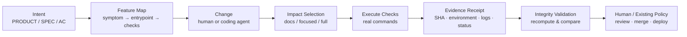

# Repository Development Contract

> **Verification-first harness for AI-assisted software development.**  
> Automate more of the development loop without giving up traceability, evidence, or human control.

AI coding agents can generate code quickly. The harder problem is deciding **what changed, what must be verified, whether the checks actually ran, and what a passing result is allowed to mean**.

Repository Development Contract is an opinionated, lightweight harness for that problem. It combines repository-level intent, feature navigation, risk-proportional verification, executable checks, and evidence handoff so that humans and coding agents can work against the same source of truth.

한국어로 요약하면: **AI에게 코드를 많이 쓰게 하는 것보다, 잘못하기 어렵고 결과를 검증할 수 있는 개발 환경을 만드는 데 초점을 둔 템플릿입니다.**

---

## Why this exists

The goal is not maximum agent autonomy. The goal is **maximum useful automation under explicit verification and control boundaries**.

This repository is built around a few principles:

- **Make the correct path the easy path.** Put recurring constraints into architecture, lint, contracts, and executable checks instead of relying only on prompts.
- **Verify behavior, not narratives.** “I tested it” is not evidence. Record the actual command, source state, environment, result, and logs.
- **Scale verification with risk.** Run the smallest convincing set of checks for the change; escalate when shared contracts, authority, durable data, calculations, or unmapped impact are involved.
- **Keep source-of-truth ownership clear.** Product intent, architecture, data flow, feature navigation, execution evidence, and approval are related but not interchangeable.
- **Do not turn the harness into a bottleneck.** Avoid micro-sliced PRs, duplicate full regression, unnecessary multi-model review, and paperwork that does not improve confidence.

---

## The development loop



A passing verification result is **evidence**, not approval. Merge, deployment, durable business decisions, and external actions remain under the repository or organization’s existing authorization model.

---

## What is included

| Area | Purpose | Main entry point |
|---|---|---|
| Development contract | Authority, source-of-truth, work-unit, and verification rules | `AGENTS.md` |
| Product intent | Problem, actors, business requirements | `docs/PRODUCT.md` |
| Architecture | Component responsibilities and boundaries | `docs/ARCHITECTURE.md` |
| Data flow | Source → transformation → persistence → consumer lineage | `docs/DATA_FLOW.md` |
| Feature-level contract | Feature behavior and acceptance criteria | `specs/` |
| Verification policy | Risk-proportional verification and evidence semantics | `docs/HARNESS.md` |
| Feature navigation | Symptom → feature → spec → source → test lookup | `tools/feature_map.py` |
| Verification runner | Select and execute the relevant check set | `tools/verify.py` |
| Evidence integrity | Recompute the plan and validate receipt/log consistency | `tools/verify_receipt.py` |
| Runnable journey pilot | Disposable environment for an actual CLI journey | `tools/harness_journey.py` |
| Local adoption | Integrate without replacing existing registry/lease/runner owners | `docs/LOCAL_ADOPTION.md` |

The repository itself is also used as the pilot system. Its current runnable feature map lives in `harness/verification.json`.

---

## Core ideas

### 1. Risk-proportional verification

Verification is selected from the actual change surface.

- **docs** — documentation-only changes and lightweight structural checks
- **focused** — affected feature checks and its real journey
- **full** — shared/high-risk or unmapped changes, integration/release needs, or existing mandatory policy

The runner will not silently downgrade a change below its computed minimum profile. Duplicate check IDs are executed once.

```sh
# Plan only — this does not execute verification
python -B tools/verify.py --base origin/main --plan

# Execute the selected verification once
python -B tools/verify.py   --base origin/main   --output ../rdc-evidence/run-001   --context local
```

`origin/main` is only an example. Use an approved comparison ref or immutable commit for your environment.

---

### 2. Feature Map as navigation infrastructure

The feature map is not a second requirements database. It connects existing intent and code so that an agent can move from a vague report to the relevant implementation and verification path.

```text
user symptom
  ↓
feature
  ↓
SPEC / Acceptance Criteria
  ↓
actual source entrypoints
  ↓
tests / journey / failure probe
```

Example:

```sh
python -B tools/feature_map.py lookup --query "verification missing"
python -B tools/feature_map.py lint
```

The current implementation resolves Python symbols and Markdown acceptance headings without importing or executing the target code. Broken references fail lint rather than silently becoming stale navigation.

The map is deliberately **navigation**, not diagnosis. Matching a feature does not prove the root cause.

---

### 3. Evidence-producing verification

The runner records the source state and actual execution rather than only returning a green/red summary.

A receipt can include:

- head / base / merge-base SHA
- dirty workspace state and workspace digest
- selected profile and checks
- actual argv
- environment and non-secret context
- PASS / FAIL / TIMEOUT / ERROR / NOT_RUN / STALE
- elapsed time
- log path, size, and SHA-256
- run ID and timestamps

A failed check stops the remaining sequence and leaves them as `NOT_RUN`. There is no automatic retry-to-green.

Evidence is written outside the checkout to reduce source/evidence collisions.

---

### 4. Receipt integrity is not execution attestation

`tools/verify_receipt.py` recomputes the expected source state and check plan and compares them with the submitted receipt and logs.

It can detect inconsistencies such as:

- stale or different source state
- missing, duplicated, or unexpected checks
- command drift
- altered or missing log bytes
- mismatched run/context/manifest
- failed, timed-out, or not-run checks reported as success

It **cannot** prove that an untrusted producer honestly executed the commands. A producer who controls both the receipt and logs can fabricate matching hashes.

For that reason, verified evidence does not imply:

```text
execution_attested = true
merge_authorized   = true
```

Trusted execution environments, independent review, branch protection, and approval policy remain separate concerns.

See `docs/EVIDENCE_INTEGRITY.md`.

---

### 5. Factory-ready execution before agent scale

Before scaling to many agents, a feature should be easy to reproduce in a controlled environment:

```text
prepare known state
→ start or invoke the real product path
→ exercise a success case
→ exercise a discriminating failure case
→ inspect observable output
→ collect evidence
→ clean up only owned resources
```

This repository includes a native CLI pilot through `tools/harness_journey.py`. It is a harness self-test, not proof that another product’s UI or business workflow is correct.

For a web or service product, replace that pilot with the product’s real input → processing → output journey, reusing the project’s existing browser, database, container, or test-environment tooling.

See `docs/FACTORY_READY.md`.

---

## Source-of-truth model

The intended hierarchy is:

```text
PRODUCT
  ↓
ARCHITECTURE
  ↓
DATA_FLOW
  ↓
Feature SPEC / ACCEPTANCE
  ↓
source code + tests
  ↓
execution evidence
```

Code establishes **AS-IS behavior**. Approved product/spec documents establish **intended behavior**. When they disagree, the disagreement should be surfaced — not silently normalized by rewriting one from the other.

Structural references can be automated. Semantic intent still requires explicit ownership.

---

## Human, deterministic, and AI responsibilities

This repository does not prescribe one universal operating model, but it encourages explicit boundaries.

| Responsibility | Typical owner |
|---|---|
| Deterministic validation, invariants, selection, reconciliation | Code / rules |
| Navigation, implementation, test execution, candidate generation | Coding agent or developer |
| Ambiguous judgment, policy changes, exceptions | Human / domain owner |
| Merge, deployment, durable decisions, external actions | Existing authorized control |

A task performed by an LLM does not automatically gain decision authority. A human-owned outcome does not mean every step must be performed manually.

For regulated or high-stakes workflows, these boundaries should be modeled at the task level rather than labeling an entire module “AI” or “human”.

---

## Adopting this in an existing repository

Do **not** blindly copy the whole harness over an established development system.

First identify the existing owners of:

- feature registry or product map
- agent registry / authority model
- work leases or concurrency control
- verification entry point
- test fixtures and expected-result oracle
- CI / branch protection / review policy

Then integrate only the missing contracts and evidence path.

If you already have a good runner, keep it. If you already have a feature registry, extend or export it instead of creating another manually maintained source of truth.

See `docs/LOCAL_ADOPTION.md`.

---

## Quick start

Requirements:

- Python 3.10+
- Git
- no external Python packages for the core harness

```sh
# 1. Validate repository feature navigation
python -B tools/feature_map.py lint

# 2. Inspect what would run
python -B tools/verify.py --base origin/main --plan

# 3. Run verification and write evidence outside the checkout
python -B tools/verify.py   --base origin/main   --feature harness-verification   --output ../rdc-evidence/run-001   --context local

# 4. Run the repository's disposable native journey directly
python -B tools/harness_journey.py
```

For receipt-integrity usage, see `docs/EVIDENCE_INTEGRITY.md`.

---

## What this project intentionally does not do

This is not:

- an autonomous merge or deployment bot
- an OS-level sandbox
- a universal agent orchestrator
- a proof that a test suite is semantically correct
- an execution-attestation or cryptographic identity system
- a replacement for product-specific E2E testing
- a reason to run every regression suite on every change
- a requirement to use multiple LLM judges for ordinary PRs

The harness is designed to make development **more observable, reproducible, and falsifiable** without turning verification itself into the next bottleneck.

---

## Repository structure

```text
.
├── AGENTS.md
├── docs/
│   ├── PRODUCT.md
│   ├── ARCHITECTURE.md
│   ├── DATA_FLOW.md
│   ├── HARNESS.md
│   ├── FACTORY_READY.md
│   ├── EVIDENCE_INTEGRITY.md
│   ├── LOCAL_ADOPTION.md
│   └── decisions/
├── harness/
│   ├── verification.json
│   ├── fixtures/
│   ├── skills/
│   └── examples/
├── specs/
│   ├── _template/
│   └── harness-verification/
├── tools/
│   ├── verify.py
│   ├── verify_receipt.py
│   ├── feature_map.py
│   └── harness_journey.py
└── tests/
```

---

## Design goal

The long-term direction is simple:

> **A development system where agents can understand the product, make bounded changes, execute the real path, produce evidence, and leave the final authority boundary explicit.**

The metric is not how many agents or PRs the system can produce.

The metric is how much of the development loop can be automated **without losing the ability to explain, reproduce, and challenge the result**.
