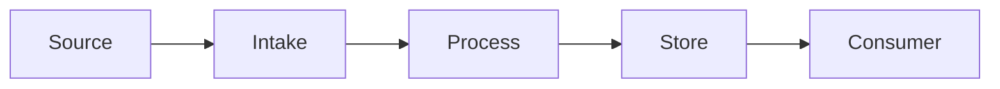

# Architecture

> 위 다이어그램은 골격입니다. 실제 컴포넌트 이름으로 교체하고, 아래 `## Components`에 각 노드를 `CMP-xxx`로 정의하세요.

## Components

### CMP-001: \<name\>

- **Responsibility:** (이 컴포넌트가 하는 일 — 한 가지로 명확하게)
- **Input:**
- **Output:**
- **Owner:**
- **Depends on:**
- **Must NOT:** (이 컴포넌트가 절대 하지 않아야 하는 일)
- **Failure behavior:** (실패 시 어떻게 동작하는가 — fail closed/open, 예외 전파 등)

<!-- 컴포넌트가 늘어나면 위 블록을 복사해 CMP-002, CMP-003 ... 순서로 추가하세요. -->

## Optional development tooling (outside the product runtime)

### CMP-900: Verification contract gate

- **Responsibility:** Validate feature-to-check mappings and local evidence receipt consistency.
- **Input:** Versioned map, receipt, expected feature/run/revision, repository files.
- **Output:** Machine-readable `map_valid`, `evidence_valid` or `blocked`; never a product approval.
- **Owner:** Repository maintainer; implementation in `tools/verification_contract.py` and CLI in `tools/verify_contract.py`.
- **Depends on:** Python standard library; Git for receipt-mode revision/clean-worktree checks.
- **Must NOT:** Run map commands, invoke models, access the network, duplicate business logic, own leases/agent authority, promote durable decisions, merge or deploy.
- **Failure behavior:** Missing, malformed, inconsistent or incomplete evidence blocks; not-run is not pass.
- **Trust boundary:** Hashes detect inconsistency, not dishonest producers. A trusted isolated verifier and separately protected review/CI policy remain necessary. See `docs/HARNESS.md`.
