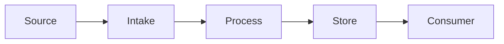

# Architecture

> 위 다이어그램은 골격입니다. 실제 컴포넌트 이름으로 교체하고, 아래 `## Components`에 각 노드를 `CMP-xxx`로 정의하세요.

## Components

### CMP-001: \<name\>

- **Responsibility:** (이 컴포넌트가 하는 일 — 한 가지로 명확하게)
- **Input:**
- **Output:**
- **Owner:**
- **Depends on:**
- **Must NOT:** (이 컴포넌트가 절대 하지 않아야 하는 일)
- **Failure behavior:** (실패 시 어떻게 동작하는가 — fail closed/open, 예외 전파 등)

<!-- 컴포넌트가 늘어나면 위 블록을 복사해 CMP-002, CMP-003 ... 순서로 추가하세요. -->

## Development tooling (not product runtime)

**CMP-H001: Verification planner/runner** — `tools/verify.py`.
Responsibility/input/output/owner/dependencies/failure boundaries are defined in
[HARNESS.md](HARNESS.md#cmp-h001-선택기와-실행기). It consumes the feature/check map,
executes existing commands and emits evidence only. It does not replace the local
agent registry, authority, lease, application runtime or merge control.
