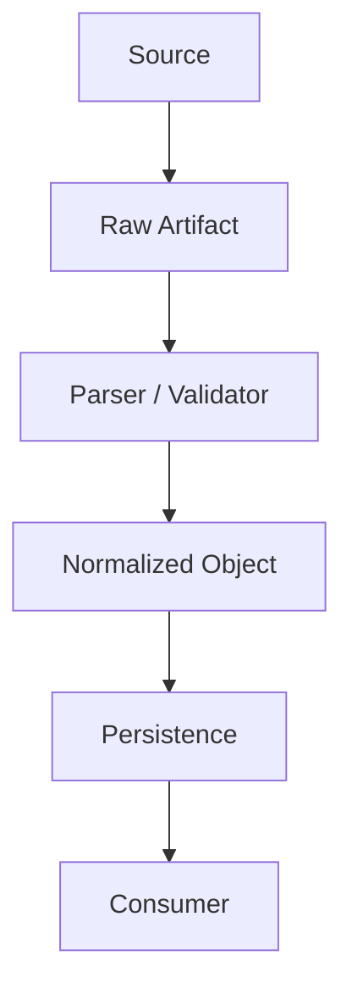

# Data Flow

> 위 다이어그램은 골격입니다. 실제 데이터 흐름으로 교체하고, 아래 `## Nodes`에 각 단계를 `DF-xxx`로 정의하세요. ID는 코드/테스트에서 그대로 참조합니다 (`AGENTS.md`의 ID & Traceability Convention 참고).

## Nodes

### DF-001

- **Source:** (데이터가 어디서 오는가)
- **Input schema:**
- **Transformation:** (무엇을 하는가)
- **Output schema:**
- **Persistence:** (저장 위치/형태, 저장하지 않으면 "N/A")
- **Downstream consumer:** (다음에 이 데이터를 쓰는 곳 — `DF-xxx` 또는 `CMP-xxx`)
- **Failure / exception path:** (검증 실패, 스키마 불일치 등이 발생하면 어디로 가는가)

<!-- 노드가 늘어나면 위 블록을 복사해 DF-002, DF-003 ... 순서로 추가하세요. -->

## Optional verification evidence flow

### DF-900

- **Source:** Existing feature catalog (where present), approved check definitions and the existing local verifier.
- **Input schema:** Version 1 map and receipt; field contract in `docs/HARNESS.md`.
- **Transformation:** Validate IDs/references/paths, exact required-check coverage, revision/run/map binding, timestamps and artifact bytes against SHA-256.
- **Output schema:** JSON gate result with explicit scope and `merge_authorized: false`.
- **Persistence:** Gate writes no files. The existing runner owns ignored `artifacts/verification/<run_id>/` evidence and receipt storage.
- **Downstream consumer:** `CMP-900`, local coordinator and independent reviewer; no direct business-state transition.
- **Failure / exception path:** Exit 1 with `blocked`; CLI invocation errors exit 2. Missing or stale evidence must be rerun, not edited into a pass.
