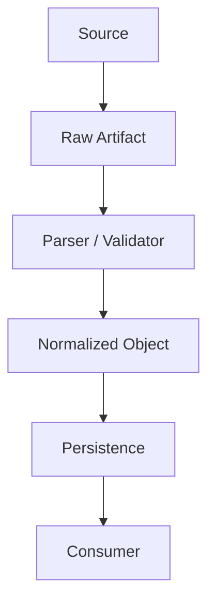

# Data Flow

> 위 다이어그램은 골격입니다. 실제 데이터 흐름으로 교체하고, 아래 `## Nodes`에 각 단계를 `DF-xxx`로 정의하세요. ID는 코드/테스트에서 그대로 참조합니다 (`AGENTS.md`의 ID & Traceability Convention 참고).

## Nodes

### DF-001

- **Source:** (데이터가 어디서 오는가)
- **Input schema:**
- **Transformation:** (무엇을 하는가)
- **Output schema:**
- **Persistence:** (저장 위치/형태, 저장하지 않으면 "N/A")
- **Downstream consumer:** (다음에 이 데이터를 쓰는 곳 — `DF-xxx` 또는 `CMP-xxx`)
- **Failure / exception path:** (검증 실패, 스키마 불일치 등이 발생하면 어디로 가는가)

<!-- 노드가 늘어나면 위 블록을 복사해 DF-002, DF-003 ... 순서로 추가하세요. -->

## Development evidence (not product data)

`DF-H001`: Git change + feature/check map -> selected plan.
`DF-H002`: plan + actual command execution -> receipt/logs -> existing review record.
Schemas, persistence and exception paths are defined in [HARNESS.md](HARNESS.md).
Evidence is stored outside the checkout; product data and approval state are not modified by the runner itself.
